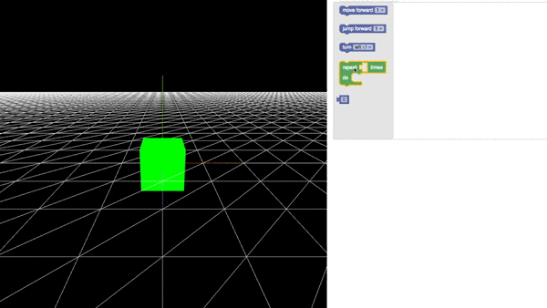

# Boilerplate for using Google Blockly, es6, browserify and three.js

Here a self explanatory gif that clarifies what this repo is about.

## Installation
Clone the repository and run `npm install`.

## Clone blocky
Clone the Blockly repository https://github.com/google/blockly inside the build folder. The blockly npm package is not included in the package.json file because it does not play well with the build system, I'm loading it separately.

Once the installation is done, run `gulp`. You should see a page with some blocks to drag and drop

## How to create custom bloks
The fastest way to create new blocks is to use the [online editor](https://blockly-demo.appspot.com/static/demos/blockfactory/index.html).

[Here](https://developers.google.com/blockly/guides/create-custom-blocks/blockly-developer-tools) you can find the documentation and a video tutorial
